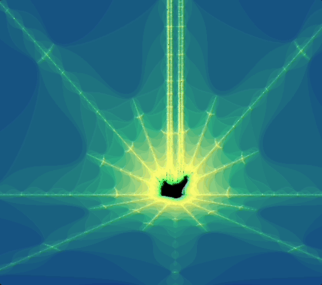

# Fractol

<div style="display" align="center">



</div>

## About

I am pleased to present my first graphic project, which was created using the school's graphic library, **MiniLibX**.

This project allowed me to discover the many features offered by this library while exploring different issues in graphic programming, including optimization and event handling.

The first part of my program, available in **'./fractol'**, offers you the opportunity to discover the **Julia** and **Mandelbrot** sets.
Thanks to the scroll wheel on your mouse, you can zoom in and out infinitely to explore these fascinating sets.

In the bonus part of my program, **'./fractol_bonus'**, you can also discover the **BurningShip** and **Tricorn** sets.
You can move within these sets using the arrow keys on your keyboard, and enjoy additional colors for an even more immersive experience.

I am proud of this first graphic project, which allowed me to develop my skills in graphic programming while exploring fascinating mathematical sets. I hope you enjoy discovering these sets through my program, and please feel free to provide me with your feedback and suggestions to further improve this experience.

### Main part
|Commands|Functionality|
|-|-|
|ESC| exit the program |
|mouse wheel| zoom int / zoom out|

### Bonus part
|Commands|Functionality|
|-|-|
|ESC key| exit the program |
|mouse wheel| zoom int / zoom out|
|r|reset to the origin|
|+|increase precision|
|-|decrease precision|
| 1 to 4 |differents colors|
|arrows| moves|
|space key| allow / disallow julia variation|

## Getting Started

First, clone the repository:

```` bash
git clone git@github.com:ltrinchini/Fractol.git
cd Fractol
git submodule update --init libft
````

Then, compile the program by running:
````bash
make
````
or
````bash
make bonus
````

## Usage

### Main part
```bash
--------------------------------------------
Target_name: mandelbrot | julia
Julia use "./fractol julia nb_reel nb_imag"
Ex: ./julia 0.3 -0.5
--------------------------------------------

./fractol Target_name
````

### Bonus part
```` bash
-------------------------------------------------------
Target_name: mandelbrot | julia | tricorn | burningship
Julia use "./fractol julia nb_reel nb_imag"
Ex: ./julia 0.3 -0.5
-------------------------------------------------------

./fractol Target_name
````
